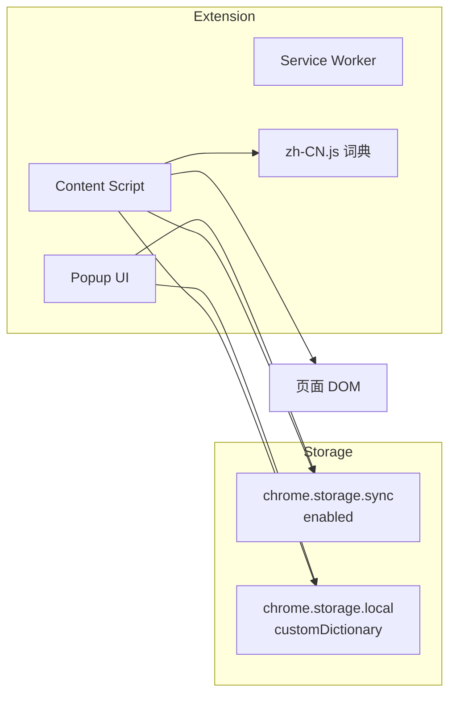

# DarkTrans — Dark and Darker Tracker 汉化插件

为 [darkanddarkertracker.com](https://darkanddarkertracker.com) 地图与任务追踪页面提供中文汉化的 Chrome 扩展（Manifest V3）。

## 功能特性

- **页面实时汉化**：在目标站点自动替换 DOM 文本及 `placeholder`、`title`、`aria-label`、`alt` 等属性
- **动态内容支持**：通过 `MutationObserver` 监听页面变化，SPA 路由切换后仍可继续翻译
- **开关控制**：可在扩展弹窗中随时启用或关闭汉化
- **自定义词典**：支持导入 / 导出 JSON，覆盖或补充内置翻译
- **分类词条库**：覆盖地图地点、怪物、容器、陷阱、草药、战利品、物品、任务等游戏相关术语

## 适用站点

| 页面 | 说明 |
|------|------|
| `https://darkanddarkertracker.com/maps` | 交互式地图（主要目标） |
| `https://darkanddarkertracker.com/questtracker` | 任务追踪页 |
| 同域名下其他页面 | 共用 content script，同样生效 |

## 安装方式

### 方式一：加载已解压扩展（开发 / 本地）

1. 克隆本仓库并安装依赖：

```bash
git clone <仓库地址>
cd darkTrans
npm install
```

2. 构建扩展：

```bash
# 开发构建（含热重载）
npm run dev

# 或仅构建生产版本
npm run build:prod
```

3. 在 Chrome 打开 `chrome://extensions/`
4. 开启右上角「开发者模式」
5. 点击「加载已解压的扩展程序」，选择输出目录：
   - 开发模式：`dist/dev/`
   - 生产模式：`dist/extension/`

### 方式二：安装打包文件

```bash
npm run build
```

执行后在 `dist/` 目录生成 `darktrans-v1.0.0.zip`，解压后在 Chrome 扩展管理页加载解压后的文件夹，或按 Chrome 商店侧载流程安装。

## 使用说明

1. 安装扩展后，访问 [darkanddarkertracker.com](https://darkanddarkertracker.com)
2. 点击浏览器工具栏中的 **DarkTrans** 图标打开弹窗
3. 使用「启用汉化」开关控制翻译状态
4. 弹窗底部可查看内置词条与自定义词条数量

### 词典导入 / 导出

弹窗「词典」区域支持：

| 操作 | 说明 |
|------|------|
| **导出全部** | 导出内置词典 + 自定义词条的合并结果 |
| **导出自定义** | 仅导出用户自定义词条 |
| **导入 JSON** | 从 JSON 文件导入词条到本地存储 |

**导入选项：**

- 勾选「导入时合并到现有自定义词条」：新词条与已有自定义词条合并（同 key 以导入为准）
- 不勾选：导入内容将完全替换现有自定义词条

**支持的 JSON 格式：**

```json
// 1. 扁平对象
{
  "Ruins of Forgotten Castle": "城堡一层",
  "Goblin Cave": "哥布林洞穴一层"
}
```

```json
// 2. 带 entries 字段的对象（导出格式）
{
  "version": 1,
  "exportedAt": "2026-05-28T00:00:00.000Z",
  "scope": "custom",
  "entries": {
    "Some Item": "某物品"
  }
}
```

```json
// 3. 数组格式
[
  { "en": "Monsters", "zh": "怪物" },
  { "english": "Traps", "chinese": "陷阱" }
]
```

也兼容 `metaData/transition.json` 的分类嵌套结构，导入时会自动扁平化。

## 项目结构

```
darkTrans/
├── manifest.json              # Chrome 扩展清单
├── icons/                     # 扩展图标（npm install 时自动生成）
├── src/
│   ├── background/
│   │   ├── service-worker.js  # 后台 Service Worker
│   │   └── dev-reloader.js    # 开发模式热重载（仅 dev 构建注入）
│   ├── content/
│   │   ├── index.js           # Content Script 入口
│   │   ├── translator.js      # DOM 翻译引擎
│   │   └── dev.js             # 开发模式标记
│   ├── popup/
│   │   ├── popup.html         # 扩展弹窗 UI
│   │   ├── popup.js
│   │   └── popup.css
│   ├── shared/
│   │   └── i18n-json.js       # JSON 导入 / 导出解析
│   └── locales/
│       ├── zh-CN.js           # 词典合并入口
│       └── category/          # 分类词条（部分由脚本生成）
│           ├── mapLocations.js
│           ├── containers.js
│           ├── monsters.js
│           ├── herbs.js
│           ├── traps.js
│           ├── loot.js
│           ├── items.js
│           └── quests.js
├── metaData/                  # 翻译数据源与中间文件
├── scripts/                   # 构建与词条生成脚本
└── dist/                      # 构建输出（git 忽略）
    ├── dev/                   # 开发构建
    └── extension/             # 生产构建
```

## 开发指南

### 环境要求

- Node.js 18+
- Google Chrome（或基于 Chromium 的浏览器）

### 常用命令

| 命令 | 说明 |
|------|------|
| `npm run dev` | 启动开发模式：监听文件变更、自动重建、热重载扩展 |
| `npm run build:dev` | 单次开发构建 → `dist/dev/` |
| `npm run build:prod` | 单次生产构建 → `dist/extension/` |
| `npm run build` / `npm run package` | 生产构建并打包 zip |
| `npm run icons` | 生成扩展图标 |

### 开发模式工作流

1. 运行 `npm run dev`
2. 在 Chrome 加载 `dist/dev/` 目录（扩展名称会显示为 `[DEV] Dark and Darker Tracker 汉化`）
3. 修改 `src/` 或 `manifest.json` 后，脚本会自动重建并通过 WebSocket（端口 `35729`）触发扩展与目标页面刷新

### 架构概览



**翻译流程：**

1. `zh-CN.js` 合并各分类词典为 `window.DARKTRANS_DICTIONARY`
2. `index.js` 读取内置词典，并与 `chrome.storage.local` 中的自定义词条合并
3. `DarkTransTranslator` 遍历 DOM，按词条长度降序匹配（优先长词），支持子串替换
4. `MutationObserver` 在 DOM 变化时 debounce 后重新翻译

**跳过翻译的元素：**

- `script`、`style`、`code`、`pre`、`textarea`、`svg` 等标签
- 带有 `data-darktrans-skip` 属性的元素
- `contenteditable` 元素

## 维护翻译数据

部分词条文件由脚本自动生成，**请勿手动编辑**以下文件：

- `src/locales/category/items.js` — 由 `npm run extract-item-names` 生成
- `src/locales/category/quests.js` — 由 `npm run merge-quest-i18n` 生成
- `src/locales/category/mapLocations.js` 等 — 由 `npm run merge-transition` 从 `metaData/transition.json` 生成

### 词条维护命令

| 命令 | 说明 |
|------|------|
| `npm run extract-strings` | 从站点 UI 提取字符串 |
| `npm run merge-transition` | 将 `metaData/transition.json` 合并为 category 词典 |
| `npm run extract-item-names` | 从游戏数据与 NFU  Wiki 提取物品名并合并到 `items.js` |
| `npm run quest-i18n` | 拉取任务追踪数据 → 生成任务 i18n → 合并到 `quests.js` |
| `npm run fetch-quest-tracker` | 仅拉取 questtracker 原始数据 |
| `npm run generate-quest-i18n` | 仅生成 `metaData/quest-i18n.json` |
| `npm run merge-quest-i18n` | 仅合并任务词条到 `quests.js` |

### 词典合并优先级

`zh-CN.js` 中合并顺序（后者覆盖前者）：

1. 任务（quests）
2. 物品（items）
3. 战利品（loot）
4. 地图地点（mapLocations）
5. 容器（containers）
6. 怪物（monsters）
7. 草药（herbs）
8. 陷阱（traps）
9. UI 固定词条（优先级最高）

自定义词条在运行时覆盖以上全部内置词条。

## 权限说明

| 权限 | 用途 |
|------|------|
| `storage` | 保存汉化开关状态与自定义词典 |
| `host_permissions: darkanddarkertracker.com` | 在目标站点注入 content script |

开发构建额外申请 `tabs` 权限及本地 WebSocket 主机权限，用于热重载。

## 版本

当前版本：**1.0.0**（见 `manifest.json`）

## 许可证

ISC

## 免责声明

本插件为非官方社区项目，与 Ironmace / Dark and Darker 官方及 darkanddarkertracker.com 站点无隶属关系。翻译内容仅供参考，游戏内名称以官方版本为准。
