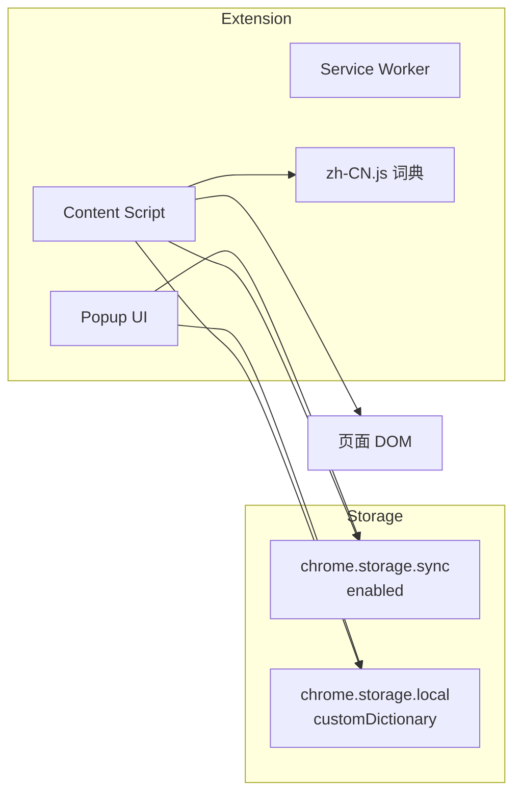

# DarkTrans — Dark and Darker Tracker 汉化插件

为 [darkanddarkertracker.com](https://darkanddarkertracker.com) 地图与任务追踪页面提供中文汉化的 Chrome 扩展（Manifest V3）。

## 功能特性

- **页面实时汉化**：在目标站点自动替换 DOM 文本及 `placeholder`、`title`、`aria-label`、`alt` 等属性
- **地图标注汉化**（`/maps`）：地图地点名以 SVG `<text>` 绘制为 Pixi 纹理，Hook `encodeURIComponent` 在转 data URL 前翻译并加宽中文标签；地图 JSON 经 Worker 代理返回时深度翻译字符串字段
- **地图 JSON 加载兼容**：站点用 `blob:` Worker 拉取 `/ProcessedModules/*.json`；扩展以**限流队列**代理请求，页面 `fetch` 失败时改由**扩展后台**拉取（缓解 `ERR_CONNECTION_CLOSED`）
- **动态内容支持**：通过 `MutationObserver` 监听页面变化，SPA 路由切换后仍可继续翻译
- **开关控制**：可在扩展弹窗中随时启用或关闭汉化
- **自定义词典**：支持导入 / 导出 JSON，覆盖或补充内置翻译
- **统一内置词典**：覆盖地图地点、怪物、容器、陷阱、草药、战利品、物品、任务等游戏相关术语

## 适用站点

| 页面 | 说明 |
|------|------|
| `https://darkanddarkertracker.com/maps` | 交互式地图（主要目标） |
| `https://darkanddarkertracker.com/questtracker` | 任务追踪页 |
| 同域名下其他页面 | 共用 content script，同样生效 |

## 安装方式

### 方式一：加载已解压扩展（开发 / 本地）

1. 克隆本仓库并安装依赖：

```bash
git clone <仓库地址>
cd darkTrans
npm install
```

2. 构建扩展：

```bash
# 开发构建（含热重载）
npm run dev

# 或仅构建生产版本
npm run build:prod
```

3. 在 Chrome 打开 `chrome://extensions/`
4. 开启右上角「开发者模式」
5. 点击「加载已解压的扩展程序」，选择输出目录：
   - 开发模式：`dist/dev/`
   - 生产模式：`dist/extension/`

### 方式二：安装打包文件

```bash
npm run build
```

执行后在 `dist/` 目录生成 `darktrans-v1.0.0.zip`，解压后在 Chrome 扩展管理页加载解压后的文件夹，或按 Chrome 商店侧载流程安装。

## 使用说明

1. 安装扩展后，访问 [darkanddarkertracker.com](https://darkanddarkertracker.com)
2. 点击浏览器工具栏中的 **DarkTrans** 图标打开弹窗
3. 使用「启用汉化」开关控制翻译状态
4. 弹窗底部可查看内置词条与自定义词条数量

### 词典导入 / 导出

弹窗「词典」区域支持：

| 操作 | 说明 |
|------|------|
| **导出全部** | 导出内置词典 + 自定义词条的合并结果 |
| **导出自定义** | 仅导出用户自定义词条 |
| **导入 JSON** | 从 JSON 文件导入词条到本地存储 |

**导入选项：**

- 勾选「导入时合并到现有自定义词条」：新词条与已有自定义词条合并（同 key 以导入为准）
- 不勾选：导入内容将完全替换现有自定义词条

**支持的 JSON 格式：**

```json
// 1. 扁平对象
{
  "Ruins of Forgotten Castle": "城堡一层",
  "Goblin Cave": "哥布林洞穴一层"
}
```

```json
// 2. 带 entries 字段的对象（导出格式）
{
  "version": 1,
  "exportedAt": "2026-05-28T00:00:00.000Z",
  "scope": "custom",
  "entries": {
    "Some Item": "某物品"
  }
}
```

```json
// 3. 数组格式
[
  { "en": "Monsters", "zh": "怪物" },
  { "english": "Traps", "chinese": "陷阱" }
]
```

也兼容 `metaData/transition.json` 的分类嵌套结构，导入时会自动扁平化。

## 项目结构

```
darkTrans/
├── manifest.json              # Chrome 扩展清单
├── icons/                     # 扩展图标（npm install 时自动生成）
├── src/
│   ├── background/
│   │   ├── service-worker.js  # 后台 Service Worker
│   │   └── dev-reloader.js    # 开发模式热重载（仅 dev 构建注入）
│   ├── content/
│   │   ├── index.js           # Content Script 入口
│   │   ├── translator.js      # DOM 翻译引擎
│   │   ├── map-canvas-page.js # 地图页主世界 Hook（Canvas / JSON）
│   │   ├── map-canvas-bootstrap.js
│   │   ├── map-fetch-bridge.js
│   │   └── dev.js             # 开发模式标记
│   ├── popup/
│   │   ├── popup.html         # 扩展弹窗 UI
│   │   ├── popup.js
│   │   └── popup.css
│   ├── shared/
│   │   └── i18n-json.js       # JSON 导入 / 导出解析
│   └── locales/
│       ├── zh-CN.json         # 内置词典数据源（手动维护）
│       └── zh-CN.js           # 由 rebuild-dictionary 自动生成，扩展运行时加载
├── metaData/                  # 历史翻译数据源（归档参考，不再参与构建）
│   └── …
├── scripts/                   # 构建与词条生成脚本
│   ├── rebuild-dictionary.js  # 从 zh-CN.json 生成 zh-CN.js
│   └── …
└── dist/                      # 构建输出（git 忽略）
    ├── dev/                   # 开发构建
    └── extension/             # 生产构建
```

## 开发指南

### 环境要求

- Node.js 18+
- Google Chrome（或基于 Chromium 的浏览器）

### 常用命令

| 命令 | 说明 |
|------|------|
| `npm run dev` | 启动开发模式：监听文件变更、自动重建、热重载扩展 |
| `npm run build:dev` | 单次开发构建 → `dist/dev/` |
| `npm run build:prod` | 单次生产构建 → `dist/extension/` |
| `npm run build` / `npm run package` | 生产构建并打包 zip |
| `npm run icons` | 生成扩展图标 |

### 开发模式工作流

1. 运行 `npm run dev`
2. 在 Chrome 加载 `dist/dev/` 目录（扩展名称会显示为 `[DEV] Dark and Darker Tracker 汉化`）
3. 修改 `src/` 或 `manifest.json` 后，脚本会自动重建并通过 WebSocket（端口 `35729`）触发扩展与目标页面刷新

### 架构概览



**翻译流程：**

1. `zh-CN.js` 暴露 `window.DARKTRANS_DICTIONARY`（由 `zh-CN.json` 生成）
2. `index.js` 读取内置词典，并与 `chrome.storage.local` 中的自定义词条合并
3. `DarkTransTranslator` 遍历 DOM，按下方「翻译匹配逻辑」替换文本
4. `MutationObserver` 在 DOM 变化时 debounce 后重新翻译

### 翻译匹配逻辑

运行时翻译**不是**按英文单词边界（word boundary）匹配，而是**词典键的精确匹配 + 子串全局替换**。实现位于 `src/content/translator.js`（DOM）与 `src/content/map-canvas-page.js`（Canvas / 地图 JSON）。

#### 词典排序

加载词典时，所有键按**长度从长到短**排序（`sortedEntries`）。翻译时优先尝试更长的键，减少短键抢先匹配造成的误替换（例如优先 `"Accessory Old Ruins"` 再匹配 `"Accessory"`）。

#### 通用翻译（`translateString`）

适用于：DOM 文本节点，`placeholder` / `title` / `aria-label` / `alt` 属性，以及 Canvas 的 `fillText` / `strokeText` / `measureText`。

| 步骤 | 规则 |
|------|------|
| 1. 整句精确匹配 | 对文本 `trim()` 后，若与词典键完全一致，则替换为对应译文，并保留原文首尾空白 |
| 2. 子串替换 | 若整句未命中，按 `sortedEntries` 顺序遍历；若当前结果 `includes(键)`，则 `split(键).join(译文)` 全局替换 |
| 3. 无单词边界 | 不使用 `\b` 等边界判断；键作为普通子串参与匹配 |

**示例：**

- 原文 `"Accessory Old Rust Room"`，词典仅有 `"Accessory": "配饰"`、无 `"Old Rust Room"` → 结果为 `"配饰 Old Rust Room"`（前缀被替换，其余保持英文）
- 若需整句汉化，应添加完整键，例如 `"Accessory Old Rust Room": "旧锈房间配饰"`

地图 Canvas 侧在以上逻辑基础上额外保护：

- **极短文本**：长度 ≤ 2 的字符串（如单个字母 `"A"`）默认不做子串替换，除非存在整句精确匹配
- **空译文**：精确匹配到的译文为空或仅空白时，不替换原文

#### 地图标注专用（`translateMapLabel`）

地图 JSON 中的展示字段（如 `label`、`displayName`、`moduleDisplayName` 等）以及 SVG `<text>` 内文字，**仅做整句精确匹配**，不做子串替换。目的是避免误改 `imagePath`、`object_name` 等内部标识字段。

模块标签另有 `resolveModuleLabel`：先尝试现有 `label` 精确匹配，再尝试 `moduleKey` 及其格式化形式（下划线 / 驼峰转空格）。

#### 维护词条时的建议

| 场景 | 建议 |
|------|------|
| 复合地点 / 实体名（如 `Accessory Old Rust Room`） | 优先添加**完整英文键**，不要只依赖单词级子串 |
| 地图 JSON / SVG 标注 | 键必须与页面展示的英文**完全一致**（含大小写、空格） |
| 自定义词条 | 运行时覆盖内置词典；同 key 以自定义为准 |

**地图页（`/maps`）额外流程：**

1. `document_start` 预加载地图词条；`map-canvas-page.js` 以 `world: MAIN` 注入（符合站点 CSP）
2. Hook `encodeURIComponent`：站点经 `btoa(unescape(encodeURIComponent(svg)))` 生成纹理，在编码前翻译 `<text>` 并按中文字宽扩展 SVG viewBox（避免标签被裁切）
3. 地图 JSON 加载时按当前词典深度翻译字符串；`document_idle` 后触发 `resize` 促使地图重绘

**若地图 metadata 仍 `Failed to fetch`：**

- 在控制台执行：`fetch('/ProcessedModules/Cave/Cave.json').then(r=>r.status)`
- 若此处也失败，请暂时关闭广告拦截后硬刷新 `/maps`
- 勿在开发模式下频繁触发热重载导致请求中断

**跳过翻译的元素：**

- `script`、`style`、`code`、`pre`、`textarea`、`svg` 等标签
- 带有 `data-darktrans-skip` 属性的元素
- `contenteditable` 元素

## 维护翻译数据

内置词典统一维护在 `src/locales/zh-CN.json` 的 `entries` 字段中。修改后运行：

```bash
npm run rebuild-dictionary
```

会重新生成 `src/locales/zh-CN.js`（扩展运行时加载此文件，**请勿手改**）。

### 词条维护命令

| 命令 | 说明 |
|------|------|
| `npm run rebuild-dictionary` | 从 `zh-CN.json` 生成 `zh-CN.js` |
| `npm run extract-strings` | 从站点 bundle 提取 UI 字符串（辅助发现未收录词条） |

`metaData/` 目录保留历史数据源，供对照参考；当前构建流程不再读取这些文件。

自定义词条在运行时覆盖全部内置词条。

## 权限说明

| 权限 | 用途 |
|------|------|
| `storage` | 保存汉化开关状态与自定义词典 |
| `host_permissions: darkanddarkertracker.com` | 在目标站点注入 content script |

开发构建额外申请 `tabs` 权限及本地 WebSocket 主机权限，用于热重载。

## 版本

当前版本：**1.0.0**（见 `manifest.json`）

## 许可证

ISC

## 免责声明

本插件为非官方社区项目，与 Ironmace / Dark and Darker 官方及 darkanddarkertracker.com 站点无隶属关系。地图地点等翻译部分参考 [dnd.wiki](https://dnd.wiki/maps) 社区 wiki，仅供参考，游戏内名称以官方版本为准。
